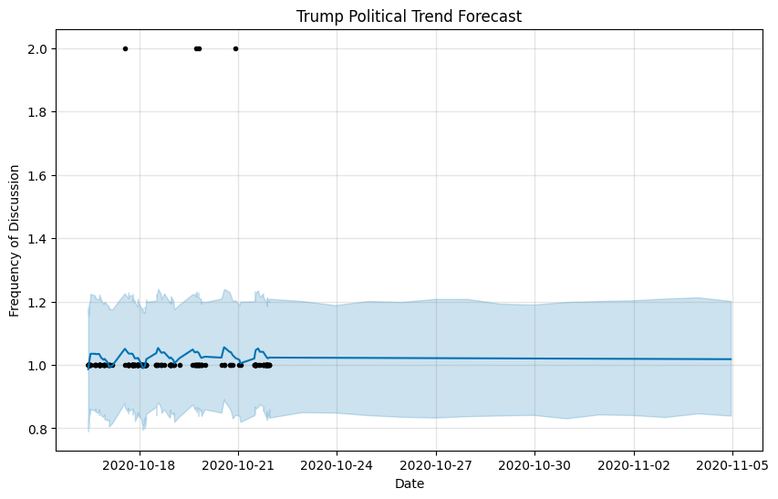
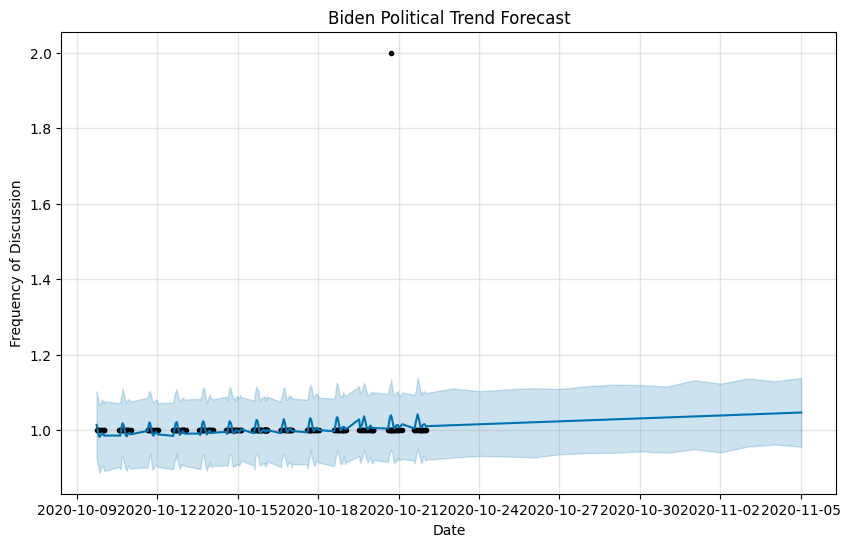
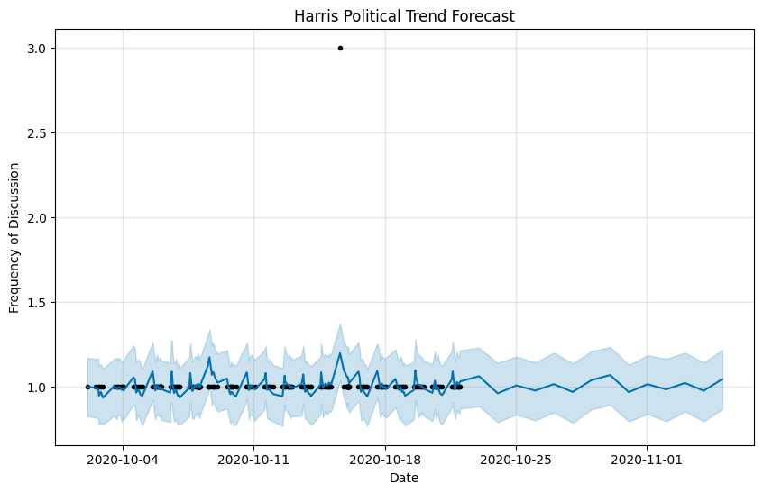
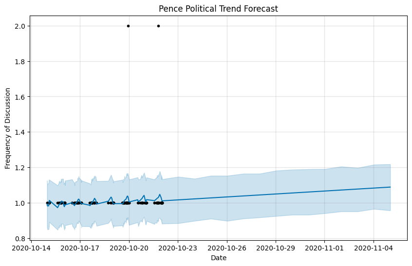
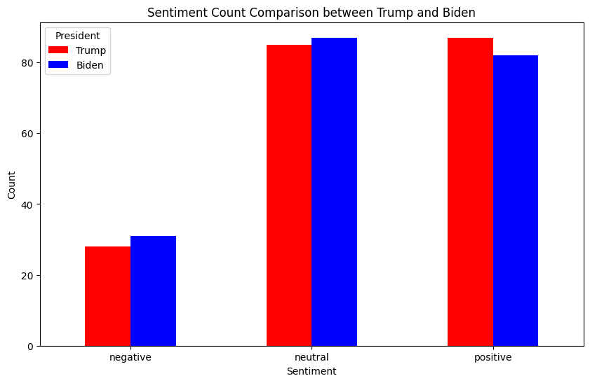
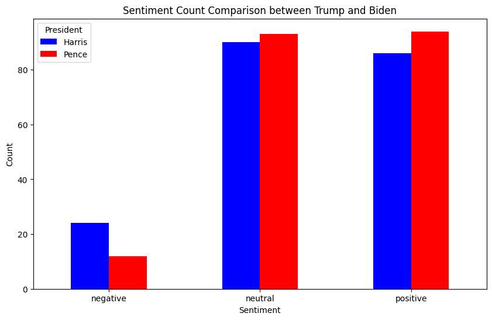

# Political_predication

## Trend Prediction from Social Media

Analyze social media data using LLMs to identify trending topics over a short period. Predict how political trends might evolve in the next few weeks.

## Data

- US 2020 Policial Tweets from https://www.kaggle.com/datasets/tunguz/united-states-political-tweets/data?select=pence_timeline.json

## Result

- Trump Political Predicition Trend 

- Biden Political Predicition Trend 

- Kamala Harris Political Prediciton Trend

- Pence Political Prediciton Trend

- Sentiment analysis based on Tweets for both Presidents

- Sentiment analysis based on Tweets for both Vice Presidents

